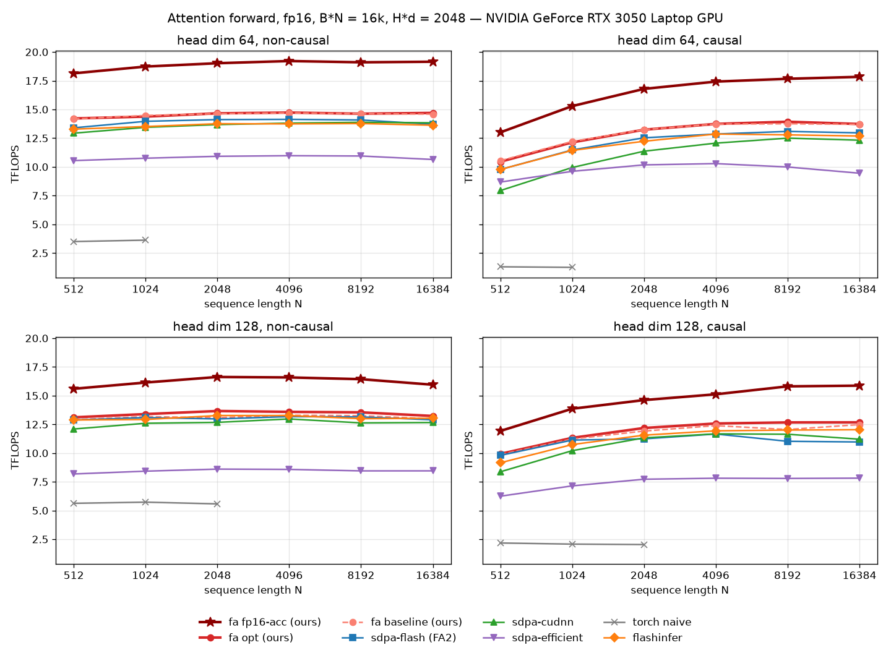

# FlashAttention-2 forward, from scratch in CUDA C++

A FlashAttention-2 forward kernel written in raw CUDA C++ and inline PTX, with no CUTLASS,
CuTe, Triton or cuDNN. It is benchmarked against the production implementations shipped in
PyTorch.

- **Tensor cores** via `mma.sync.m16n8k16` + `ldmatrix` / `ldmatrix.trans`. S and P never leave registers.
- **`cp.async` pipeline** overlapping K/V loads with compute. **XOR-swizzled** shared memory
  (bank-conflict-free, no padding).
- Online softmax in base 2. Causal masking only on diagonal tiles, with masked tiles skipped.
  N need not be a multiple of the tile size.
- FP16 in, FP32 accumulate, head dim 64 / 128, causal and non-causal, tile shapes tuned per case.
- Optional **fp16-accumulate P·V** variant that uses GeForce GPUs' 2× fp16-accumulate tensor rate.
  FA3/FA4 techniques (lazy rescaling, software exp2, deeper pipelining) were each tried and measured.

```python
import fa
o = fa.forward(q, k, v, causal=True)                    # exact: fp32 accumulation
o = fa.forward(q, k, v, causal=True, fp16_accum=True)   # faster on GeForce GPUs
# q, k, v: [B, H, N, d] fp16 CUDA tensors, d in {64, 128}
```

## Results (RTX 3050 Laptop, sm_86)



Against PyTorch SDPA's FlashAttention-2 backend, at all 24 benchmarked shapes:

- **fp16-acc: 1.21–1.45x FA2**, up to 19.5 TFLOPS.
- **opt (exact, fp32 accumulate): 1.01–1.16x FA2**, up to 14.8 TFLOPS. That equals a cuBLAS fp16
  GEMM on this GPU (14.5 TFLOPS), the fp32-accumulate ceiling.
- Also ahead of cuDNN and FlashInfer (the attention library behind vLLM / SGLang) at every shape.

Full table, method and caveats are in [docs/benchmarking.md](docs/benchmarking.md).

| d=128, N=16k | ours fp16-acc | ours opt | FA2 (SDPA flash) | cuDNN | FlashInfer | mem-efficient | naive torch |
|---|---|---|---|---|---|---|---|
| non-causal | **15.9** | **13.2** | 12.9 | 12.7 | 13.0 | 8.5 | OOM |
| causal | **15.9** | **12.7** | 11.0 | 11.2 | 12.0 | 7.8 | OOM |

FlashAttention-3/4 need Hopper/datacenter-Blackwell hardware and don't run on consumer GPUs, so
FA2 is the bar here; which of their ideas carry over, and what each one measured, is in
[docs/fa3_fa4_techniques.md](docs/fa3_fa4_techniques.md). RTX 4090 / 5090 numbers are coming.

## Quick start

```
uv venv --python 3.12 .venv
uv pip install --python .venv torch numpy pytest pandas matplotlib ninja setuptools \
    --index-url https://download.pytorch.org/whl/cu130 --extra-index-url https://pypi.org/simple \
    --index-strategy unsafe-best-match
make build        # Python extension (ARCH=8.9 for RTX 4090, 12.0 for RTX 5090)
make test         # GoogleTest + pytest
make sanitize     # compute-sanitizer memcheck / racecheck / synccheck / initcheck
make bench        # benchmark sweep + plot
make profile      # Nsight Compute reports (needs sudo for GPU counters)
```

## Documentation

| Doc | Contents |
|---|---|
| [docs/optimizations.md](docs/optimizations.md) | how the kernel works, every optimization and why |
| [docs/fa3_fa4_techniques.md](docs/fa3_fa4_techniques.md) | FA3/FA4 techniques on consumer GPUs, ablation results, number formats (fp32/fp16/bf16/fp8/fp4) |
| [docs/benchmarking.md](docs/benchmarking.md) | baselines, method, full results, tile tuning |
| [docs/testing.md](docs/testing.md) | pytest, GoogleTest building-block tests, sanitizers |
| [docs/profiling.md](docs/profiling.md) | Nsight Compute / Systems scripts and what to look for |
| [docs/setup.md](docs/setup.md) | toolchain, the two build systems, repo layout |
| [docs/worklog.md](docs/worklog.md) | what was done, in order, and open items |
